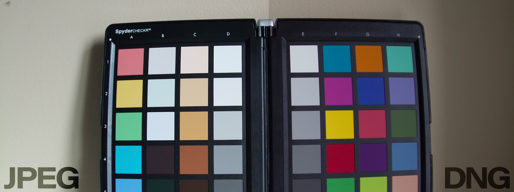

PYDNG
=========


Create Adobe DNG RAW files using Python.



**Features**
------------

- 8,10,12,14,16-bit precision
- Lossless compression
- DNG Tags ( extensible )

### Works with any **Bayer RAW** Data including native support for **Raspberry Pi cameras**.
- OV5467 ( Raspberry Pi Camera Module V1 )
- IMX219 ( Raspberry Pi Camera Module V2 )
- IMX477( Raspberry Pi High Quality Camera )

*Raspberry Pi High Quality Camera examples below ( DNG top, JPEG bottom )*


***

Instructions
------------

Requires: 
- Python3 
- Numpy  
- ExifRead


```
#install 
pip install src/.

#examples
Usage:
  from pydng.core import RPICAM2DNG

  d = RPICAM2DNG()

  # example using a file string input
  d.convert('color.jpg')


Utility.py:
  python examples/utility.py <options> <inputFilename> 
  python examples/utility.py color.jpg  

```

***

TODO
------------

- SUB IFDS/THUMBNAILS

***

Credits
------------
Source referenced from:

CanPi ( Jack ) | [color-matrices](https://www.raspberrypi.org/forums/viewtopic.php?f=43&t=278828)

Waveform80 | [picamera](https://github.com/waveform80/picamera)

Krontech | [chronos-utils](https://github.com/krontech/chronos-utils)

Andrew Baldwin | [MLVRawViewer](https://bitbucket.org/baldand/mlrawviewer)


